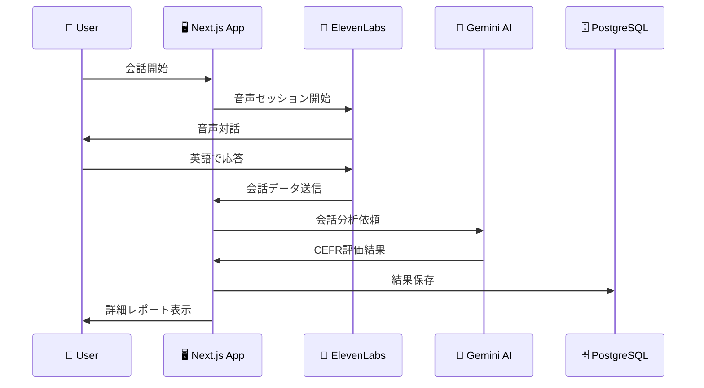

# 🎯 English Level Checker

AIと2分間の英会話で、あなたの英語力を診断。CEFR準拠の評価とパーソナライズされたフィードバックを提供します。


## ✨ 特徴

- 🎤 **リアルタイム音声対話**: ElevenLabs AIとの自然な英会話
- 📊 **CEFR準拠評価**: 国際基準に基づく正確なレベル判定
- ⚡ **2分で完了**: 短時間で信頼性の高い結果
- 📈 **5軸評価**: 流暢さ・やりとり力・文法・語彙・発音を詳細分析
- 🎯 **パーソナライズド**: 個人の強みと改善点を可視化
- 📚 **学習サポート**: 語彙カード・言い換え提案・具体的な次のステップ

## 🚀 クイックスタート

### 前提条件

- Docker & Docker Compose
- Node.js 18.0.0以上（開発時）
- 以下のAPIキー:
  - [ElevenLabs API Key](https://elevenlabs.io/)
  - [Google Gemini API Key](https://ai.google.dev/)

### インストール

1. **リポジトリをクローン**
```bash
git clone https://github.com/tea35/english-level-checker.git
cd english-level-checker
```

2. **環境変数を設定**
```bash
cp .env.example .env
# .envファイルを編集してAPIキーを設定
```

3. **Docker で起動**
```bash
docker-compose up -d --build
```

4. **アプリケーションにアクセス**
```
http://localhost:3000
```

## 🔧 環境変数

```env
# PostgreSQL
POSTGRES_USER=myuser
POSTGRES_PASSWORD=mypassword
POSTGRES_DB=mydb
DATABASE_URL="postgresql://myuser:mypassword@db:5432/mydb"

# ElevenLabs API
ELEVENLABS_API_KEY=your-elevenlabs-api-key
NEXT_PUBLIC_AGENT_ID=your-agent-id

# Google Gemini API
GEMINI_API_KEY=your-gemini-api-key
```

## 🏗️ システム構成

```
┌─────────────────┐    ┌─────────────────┐    ┌─────────────────┐
│   Next.js App  │    │   PostgreSQL    │    │  External APIs  │
│   (Frontend)    │◄──►│   Database      │    │                 │
│                 │    │                 │    │  ┌─────────────┐ │
│  ┌───────────┐  │    │  ┌───────────┐  │    │  │ ElevenLabs  │ │
│  │   Chat    │  │    │  │   Users   │  │    │  │     API     │ │
│  │   Page    │  │    │  │   Tests   │  │    │  └─────────────┘ │
│  └───────────┘  │    │  │   Turns   │  │    │                 │
│                 │    │  │  Scores   │  │    │  ┌─────────────┐ │
│  ┌───────────┐  │    │  │ Feedback  │  │    │  │   Gemini    │ │
│  │ History   │  │    │  │    ...    │  │    │  │     AI      │ │
│  │   Page    │  │    │  └───────────┘  │    │  └─────────────┘ │
│  └───────────┘  │    └─────────────────┘    └─────────────────┘
└─────────────────┘
```

## 📊 データベース設計

### 主要なテーブル

- **Test**: テスト履歴とCEFR評価結果
- **Turn**: 会話の各ターン（発話履歴）
- **Score**: 5軸評価の詳細スコア
- **Feedback**: AIからのフィードバック
- **VocabularyCard**: 学習用語彙カード
- **Paraphrase**: 言い換え提案

詳細は[ERD.md](./english-level-checker/prisma/ERD.md)を参照

## 🔄 会話分析フロー



## 🛠️ 開発

### ローカル開発環境

```bash
# 依存関係インストール
npm install

# データベース準備
npx prisma generate
npx prisma migrate dev

# 開発サーバー起動
npm run dev
```

### データベース操作

```bash
# Prisma Studio（データベースGUI）
npx prisma studio

# マイグレーション作成
npx prisma migrate dev --name your-migration-name

# データベースリセット
npx prisma migrate reset
```

## 📁 プロジェクト構成

```
english-level-checker/
├── src/
│   ├── app/                    # Next.js App Router
│   │   ├── api/               # API Routes
│   │   │   ├── analyze-conversation/
│   │   │   └── graphql/
│   │   ├── chat/              # 会話ページ
│   │   ├── history/           # 履歴ページ
│   │   └── components/        # ページコンポーネント
│   ├── components/            # 共通コンポーネント
│   │   ├── conversation.tsx   # 会話インターフェース
│   │   ├── header.tsx         # ヘッダー
│   │   └── ui/               # shadcn/ui コンポーネント
│   ├── graphql/              # GraphQL設定
│   ├── services/             # ビジネスロジック
│   ├── types/                # TypeScript型定義
│   └── lib/                  # ユーティリティ
├── prisma/                   # データベース設定
│   ├── schema.prisma         # スキーマ定義
│   ├── migrations/           # マイグレーション
│   └── seed.ts              # シードデータ
├── public/                   # 静的ファイル
├── docker-compose.yml        # Docker設定
└── Dockerfile               # アプリケーションイメージ
```

## 🎯 機能詳細

### 1. リアルタイム会話システム
- ElevenLabs Web SDK使用
- WebRTC接続でリアルタイム音声処理
- 自動音声認識と応答生成

### 2. AI分析システム
- Gemini 2.0 Flash使用
- CEFR A1-C2レベル判定
- 5軸評価：流暢さ・やりとり力・文法・語彙・発音

### 3. 学習支援機能
- 語彙カード生成
- 言い換え提案
- 具体的な改善提案
- 進捗追跡

### 4. データ可視化
- Recharts使用のレーダーチャート
- スコア推移グラフ
- 詳細分析レポート

## 🔍 API仕様

### GraphQL エンドポイント
```
POST /api/graphql
```

### 会話分析API
```
POST /api/analyze-conversation
Content-Type: application/json

{
  "conversationId": "string",
  "userId": number,
  "conversationMessages": [
    {
      "turnNumber": number,
      "speaker": "EXAMINER" | "CANDIDATE",
      "text": "string",
      "timestamp": "ISO string"
    }
  ]
}
```

## 📊 評価システム

### CEFR レベル
- **A1**: 初級 - 基本的な表現が使える
- **A2**: 初中級 - 身近な話題で簡単な会話
- **B1**: 中級 - 日常的な話題で意見交換
- **B2**: 中上級 - 複雑な内容も理解・表現
- **C1**: 上級 - 流暢で自然な表現
- **C2**: 最上級 - ネイティブレベル

### 5軸評価
1. **流暢さ** - スムーズな発話
2. **やりとり力** - 対話の自然さ
3. **文法** - 文法的正確性
4. **語彙** - 語彙の豊富さ・適切性
5. **発音** - 明瞭度・アクセント

<div align="center">
    <a href="#-english-level-checker">トップに戻る</a>
</div>
