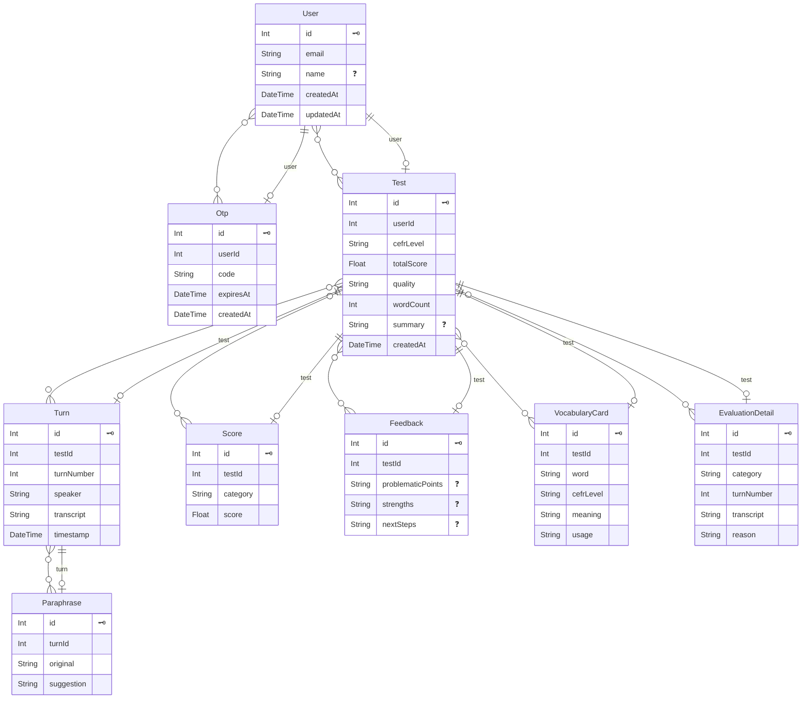

```mermaid
erDiagram

  "User" {
    Int id "🗝️"
    String email 
    String name "❓"
    DateTime createdAt 
    DateTime updatedAt 
    }
  

  "Otp" {
    Int id "🗝️"
    Int userId 
    String code 
    DateTime expiresAt 
    DateTime createdAt 
    }
  

  "Test" {
    Int id "🗝️"
    Int userId 
    String cefrLevel 
    Float totalScore 
    String quality 
    Int wordCount 
    String summary "❓"
    DateTime createdAt 
    }
  

  "Turn" {
    Int id "🗝️"
    Int testId 
    Int turnNumber 
    String speaker 
    String transcript 
    DateTime timestamp 
    }
  

  "Score" {
    Int id "🗝️"
    Int testId 
    String category 
    Float score 
    }
  

  "Feedback" {
    Int id "🗝️"
    Int testId 
    String problematicPoints "❓"
    String strengths "❓"
    String nextSteps "❓"
    }
  

  "VocabularyCard" {
    Int id "🗝️"
    Int testId 
    String word 
    String cefrLevel 
    String meaning 
    String usage 
    }
  

  "Paraphrase" {
    Int id "🗝️"
    Int turnId 
    String original 
    String suggestion 
    }
  

  "EvaluationDetail" {
    Int id "🗝️"
    Int testId 
    String category 
    Int turnNumber 
    String transcript 
    String reason 
    }
  
    "User" o{--}o "Otp" : ""
    "User" o{--}o "Test" : ""
    "Otp" o|--|| "User" : "user"
    "Test" o|--|| "User" : "user"
    "Test" o{--}o "Turn" : ""
    "Test" o{--}o "Score" : ""
    "Test" o{--}o "Feedback" : ""
    "Test" o{--}o "VocabularyCard" : ""
    "Test" o{--}o "EvaluationDetail" : ""
    "Turn" o|--|| "Test" : "test"
    "Turn" o{--}o "Paraphrase" : ""
    "Score" o|--|| "Test" : "test"
    "Feedback" o|--|| "Test" : "test"
    "VocabularyCard" o|--|| "Test" : "test"
    "Paraphrase" o|--|| "Turn" : "turn"
    "EvaluationDetail" o|--|| "Test" : "test"
```
